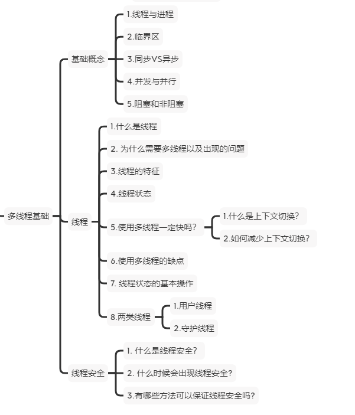
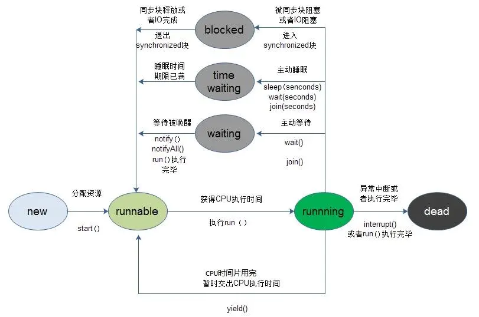

# 知识点




# 应该了解的概念

## 1. 线程与进程

**进程**是指一个内存中运行的应用程序，每个进程都有自己独立的一块内存空间，一个进程中可以启动多个线程。比如在 `Windows` 系统中，一个运行的 `exe` 就是一个进程。

**线程**是指进程中的一个执行流程，一个进程中可以运行多个线程。比如`java.exe` 进程中可以运行很多线程。线程总是属于某个进程，进程中的多个线程共享进程的内存。

### 1.1 区别

**并发性**：进程之间可以并发执行，同一个进程的多个线程之间也可并发执行。

**调度**：线程作为调度和分配的基本单位，进程作为拥有资源的基本单位 。

**根本区别**：**进程是操作系统资源分配的基本单位，而线程是任务调度和执行的基本单位**

**开销方面**：每个**进程**都有独立的代码和数据空间（程序上下文），**进程之间切换开销大**；**线程**可以看做轻量级的进程，同一类线程共享代码和数据空间，每个线程都有自己独立的运行栈和程序计数器（PC），**线程之间切换的开销小**

**包含关系**：**线程是进程的一部分**，所以**线程也被称为轻权进程或者轻量级进程**

## 2. 临界区

**临界区用来表示一种公共资源或者说是共享数据**，可以被多个线程使用。但是每个线程使用时，一旦临界区资源被一个线程占有，那么其他线程必须等待。**多个进程必须互斥的对它进行访问**。

##  3. 同步VS异步

**同步方法**：调用者必须等待被调用的方法结束后，调用者后面的代码才能执行

**异步调用**：调用者不用管被调用方法是否完成，都会继续执行后面的代码，当被调用的方法完成后会通知调用者。

## 4. 并发与并行

**并发**：多个任务交替进行，（类似单个 CPU ，通过 CPU 调度算法等，处理多个任务的能力，叫并发）

**并行**：真正意义上的“同时进行”。（类似多个 CPU ，同时并且处理相同多个任务的能力，叫做并行）

## 5. 阻塞和非阻塞

阻塞和非阻塞通常用来形容多线程间的相互影响，比如一个线程占有了临界区资源，那么其他线程需要这个资源就必须进行等待该资源的释放，会导致等待的线程挂起，这种情况就是阻塞，而非阻塞就恰好相反，它强调没有一个线程可以阻塞其他线程，所有的线程都会尝试地往前运行。


# 线程与多线程

## 1. 什么是线程

**线程是操作系统能够进行运算调度的最小单位，它被包含在进程之中，是进程中的实际运作单位。**

## 2. 为什么需要多线程以及出现的问题

**CPU、内存、I/O 设备的速度是有极大差异**的，为了合理**利用 CPU 的高性能**，平衡这三者的速度差异，计算机体系结构、操作系统、编译程序都做出了贡献

- CPU 增加了缓存，以均衡与内存的速度差异；// 导致 `可见性`问题
- 操作系统增加了进程、线程，以分时复用 CPU，进而均衡 CPU 与 I/O 设备的速度差异；// 导致 `原子性`问题
- 编译程序优化指令执行次序，使得缓存能够得到更加合理地利用。// 导致 `有序性`问题


## 3. 线程的特征

1.  **main()方法是个天然的多线程程序** 所有的Java 程序，不论并发与否，都有一个名为**主线程的Thread 对象**。执行该程序时， Java虚拟机（ JVM ）**将创建一个新Thread 并在该线程中执行main()方法**。这是**非并发应用程序中唯一的线程**，也是**并发应用程序中的第一个线程**。
2.  **Java中的线程共享应用程序中的所有资源**，包括内存和打开的文件，快速而简单地共享信息。但是必须使用同步**避免数据竞争**
3.  **Java中的所有线程都有一个优先级**，这个整数值介于Thread.MIN_PRIORITY（1）和Thread.MAX_PRIORITY（10）之间，默认优先级是Thread.NORM_PRIORITY（5）。线程的执行顺序并没有保证，**通常，较高优先级的线程将在较低优先级的线程之前执行**。

## 4. 线程状态

- **创建**(NEW)：新创建了一个线程对象，但还没有调用 start() 方法。
- **运行**(RUNNABLE)：Java 线程中将就绪（ready）和运行中（running）两种状态笼统的称为“运行”。

线程对象创建后，其他线程(比如 main 线程）调用了该对象的 start() 方法。该状态的线程位于可运行线程池中，等待被线程调度选中，获取 CPU 的使用权，此时处于就绪状态（ready）。就绪状态的线程在获得 CPU 时间片后变为运行中状态（running）。

- **阻塞**(BLOCKED)：表示线程阻塞于锁。线程的执行过程中由于一些原因进入阻塞状态比如：调用 sleep 方法、尝试去得到一个锁等等
- **超时等待**(TIMED_WAITING)：该状态不同于WAITING，它可以在指定的时间后自行返回。
- **等待**(WAITING)：进入该状态的线程需要等待其他线程做出一些特定动作（通知或中断）。
- **终止**(TERMINATED)：表示该线程已经执行完毕。
- **运行**(running)：CPU 开始调度线程，并开始执行 run 方法
- **消亡**(dead)：run 方法执行完 或者 执行过程中遇到了一个异常




## 5. 使用多线程一定快吗？

答：不一定，因为多线程会进行上下文切换，上下文切换会带来开销。

### 5.1 什么是上下文切换？

单核在一个时刻只能运行一个线程，**当在运行一个线程的过程中转去运行另外一个线程，这个叫做线程上下文切换**（对于进程也是类似）。

线程上下文切换过程中会记录 程序计数器、CPU 寄存器 的 状态等数据。

### 5.2 如何减少上下文切换？

#### 5.2.1 减少线程的数量

由于**一个CPU每个时刻只能执行一条线程**，而傲娇的我们又想让程序并发执行，操作系统只好不断地进行上下文切换来使我们从感官上觉得程序是并发执的行。因此，我们**只要减少线程的数量，就能减少上下文切换的次数**。

#### 5.2.2 控制同一把锁上的线程数量

多条线程共用同一把锁，那么当一条线程获得锁后，其他线程就会被阻塞；当该线程释放锁后，操作系统会从被阻塞的线程中选一条执行，从而又会出现上下文切换

因此，**减少同一把锁上的线程数量也能减少上下文切换的次数**

#### 5.2.3 采用无锁并发编程

- 需要**并发执行的任务是无状态的**：HASH分段

所谓**无状态是指并发执行的任务没有共享变量**，他们都独立执行。对于这种类型的任务可以按照ID进行HASH分段，每段用一条线程去执行。

- 需要**并发执行的任务是有状态的**：CAS算法

如果任务需要修改共享变量，那么必须要控制线程的执行顺序，否则会出现安全性问题。你可以给任务加锁，保证任务的原子性与可见性，但这会引起阻塞，从而发生上下文切换；为了避免上下文切换，你可以使用CAS算法， **仅在线程内部需要更新共享变量时使用CAS算法来更新，这种方式不会阻塞线程，并保证更新过程的安全性**(具体的方式后面的文章会将)。

## 6. 使用多线程的缺点

### 6.1 上下文切换的开销

当 **CPU  从执行一个线程切换到执行另外一个线程**的时候，它**需要先存储当前线程的本地的数据，程序指针**等，然后**载入另一个线程的本地数据，程序指针**等，最后才开始执行。这种切换称为“上下文切换”。CPU 会在一个上下文中执行一个线程，然后切换到另外一个上下文中执行另外一个线程。上下文切换并不廉价。如果没有必要，应该减少上下文切换的发生。

### 6.2 增加资源消耗

线程在运行的时候需要从计算机里面得到一些资源。 除了 CPU，**线程还需要一些 内存来维持它本地的堆栈**。它也需要 占用操作系统中一些资源来管理线程

###  6.3 编程更复杂

在多线程访问共享数据的时候，要考虑 **线程安全 **问题 
## 7. 线程状态的基本操作

线程在生命周期内还有需要基本操作，而**这些操作会成为线程间一种通信方式**，比如使用中断（interrupted）方式**通知实现线程间的交互**等等

### 7.1 interrupted

中断可以理解为线程的一个标志位，它表示了**一个运行中的线程是否被其他线程进行了中断操作**。中断好比其他线程对该线程打了一个招呼。**其他线程可以调用该线程的interrupt()方法对其进行中断操作**，同时该线程可以调用 isInterrupted（）来感知其他线程对其自身的中断操作，从而做出响应。另外，同样可以调用**Thread的静态方法 interrupted（）对当前线程进行中断操作，该方法会清除中断标志位。**需要注意的是，**当抛出InterruptedException时候，会清除中断标志位，也就是说在调用isInterrupted会返回false。**

```java
public class InterruptDemo {
    public static void main(String[] args) throws InterruptedException {
        //sleepThread睡眠1000ms
        final Thread sleepThread = new Thread() {
            @Override
            public void run() {
                try {
                    Thread.sleep(1000);
                } catch (InterruptedException e) {
                    e.printStackTrace();
                }
                super.run();
            }
        };
        //busyThread一直执行死循环
        Thread busyThread = new Thread() {
            @Override
            public void run() {
                while (true) ;
            }
        };
        sleepThread.start();
        busyThread.start();
        sleepThread.interrupt();
        busyThread.interrupt();
        while (sleepThread.isInterrupted()) ;
        System.out.println("sleepThread isInterrupted: " + sleepThread.isInterrupted());
        System.out.println("busyThread isInterrupted: " + busyThread.isInterrupted());
    }
}
```

开启了两个线程分别为sleepThread和BusyThread, sleepThread睡眠1s，BusyThread执行死循环。然后分别对着两个线程进行中断操作，可以看出sleepThread抛出InterruptedException后清除标志位，而busyThread就不会清除标志位。

另外，同样可以通**过中断的方式实现线程间的简单交互**， while (sleepThread.isInterrupted()) 表示在Main中会持续监测sleepThread，一旦sleepThread的中断标志位清零，即sleepThread.isInterrupted()返回为false时才会继续Main线程才会继续往下执行。因此，**中断操作可以看做线程间一种简便的交互方式**。**一般在结束线程时通过中断标志位或者标志位的方式可以有机会去清理资源，相对于武断而直接的结束线程，这种方式要优雅和安全**。

### 7.2 join

**join方法可以看做是线程间协作的一种方式**，很多时候，一个线程的输入可能非常依赖于另一个线程的输出，这就像两个好基友，一个基友先走在前面突然看见另一个基友落在后面了，这个时候他就会在原处等一等这个基友，等基友赶上来后，就两人携手并进。其实线程间的这种协作方式也符合现实生活。在软件开发的过程中，从客户那里获取需求后，需要经过需求分析师进行需求分解后，这个时候产品，开发才会继续跟进。

join方法源码关键是：

```java
 while (isAlive()) {
    wait(0);
 }
```

**线程的合并是指将某一个线程A在调用A.join()方法合并到正在运行的另一个线程B中，此时线程B处于阻塞状态需要等到线程A执行完毕后才开始线程B的继续执行**

```java
public class JoinDemo {
    public static void main(String[] args) throws InterruptedException {
        TestThread t = new TestThread();
        Thread t1 = new Thread(t);
        t1.start();
        for (int i = 0; i < 100; i++) {
            /**
             * 当main线程中的i等于50的时候，就把t1线程合并到main线程中执行。此时main线程是处于阻塞状态
             * 直到t1线程执行完成后，main才开始继续执行
             */
            if (50==i) {
                t1.join();
            }
            System.out.println("main.."+i);
        }  
    }
}
class TestThread implements Runnable{
    @Override
    public void run() {
        for (int i = 0; i < 100; i++) {
            System.out.println("join.."+i);
        }  
    }
}
```


### 7.3 sleep

public static native void sleep(long millis)方法显然是Thread的静态方法，很显然它是让当前线程按照指定的时间休眠，其休眠时间的精度取决于处理器的计时器和调度器。需要注意的是如果**当前线程获得了锁，sleep方法并不会失去锁。**

```java
public static void main(String[] args) throws InterruptedException {
    int num = 10;
    while (true) {
        System.out.println(num--);
        Thread.sleep(1000);
        if (num<=0) {
            break;             
        }
    }
}
```


### 7.4 yield

该暂停方法暂停的时候不一定就暂停了，取决于CPU，假如刚暂停CPU调度又调到了该线程那就又启动了.....

```java
public class YieldDemo {
    public static void main(String[] args) throws InterruptedException {
        TestThread1 t = new TestThread1();
        Thread t1 = new Thread(t);
        t1.start();
        for (int i = 0; i < 100; i++) {
            //当main线程中的i是20的倍数时，就暂停main线程
            if (i%20==0) {
                Thread.yield();//yield写在哪个线程体中，就暂停哪个线程。这里是在main里，就暂停main线程
                System.out.println("main线程暂停");
            }
            System.out.println("main.."+i);
        }  
    }
}
class TestThread1 implements Runnable{
    @Override
    public void run() {
        for (int i = 0; i < 100; i++) {
            System.out.println("join.."+i);
        }  
    }
}
```


## 8. 两类线程

### 8.1 用户线程(User Thread)

User和Daemon两者几乎没有区别，唯一的不同之处就在于**虚拟机的离开**：如果 User Thread已经全部退出运行了，只剩下Daemon Thread存在了，虚拟机也就退出了。

### 8.2 守护线程(Daemon Thread) 

Daemon的**作用**是为其他线程的运行提供便利服务，**守护线程最典型的应用就是 GC (垃圾回收器)**

**当所有非守护线程结束时，程序也就终止，同时会杀死所有守护线程。main() 属于非守护线程。**

使用 setDaemon() 方法将一个线程设置为守护线程。

#### 8.2.1 需要注意

- **thread.setDaemon(true)必须在thread.start()之前设置**，否则会抛出一个IllegalThreadStateException异常。你不能把正在运行的常规线程设置为守护线程。
- 在**Daemon线程中产生的新线程也是Daemon的**
- 不要认为所有的应用都可以分配给Daemon来进行服务，比如读写操作或者计算逻辑。 

#### 8.2.2 守护线程的代码实践

- **前台线程是保证执行完毕的，后台线程还没有执行完毕就退出了。** 

```java
public class Test {  
　　public static void main(String args) {  
　　    Thread t1 = new MyCommon();  
　　    Thread t2 = new Thread(new MyDaemon());  
　　    t2.setDaemon(true); //设置为守护线程  
　　    t2.start();  
　　    t1.start();  
　　    }  
}  
class MyCommon extends Thread {  
　　public void run() {  
　       for (int i = 0; i < 5; i++) {  
　　            System.out.println("线程1第" + i + "次执行！");  
　　            try {  
　　                Thread.sleep(7);  
　　            } catch (InterruptedException e) {  
　                e.printStackTrace();  
　　              }  
　　        }  
　　 }  
} 
```

```java
class MyDaemon implements Runnable {  
　　public void run() {  
　　    for (long i = 0; i < 9999999L; i++) {  
　　    System.out.println("后台线程第" + i + "次执行！");  
　　    try {  
　　    Thread.sleep(7);  
　　    } catch (InterruptedException e) {  
　　    e.printStackTrace();  
　　    }  
　　}  
　}  
}
```

执行结果：

```java

   后台线程第0次执行！
　　线程1第0次执行！ 
　　线程1第1次执行！ 
　　后台线程第1次执行！ 
　　后台线程第2次执行！ 
　　线程1第2次执行！ 
　　线程1第3次执行！ 
　　后台线程第3次执行！ 
　　线程1第4次执行！ 
　　后台线程第4次执行！ 
　　后台线程第5次执行！ 
　　后台线程第6次执行！ 
　　后台线程第7次执行！
```

- **守护线程在退出的时候并不会执行finnaly块中的代码，所以将释放资源等操作不要放在finnaly块中执行，这种操作是不安全的**

```java
public class DaemonDemo {
    public static void main(String[] args) {
        Thread daemonThread = new Thread(new Runnable() {
            @Override
            public void run() {
                //daemodThread run方法中是一个while死循环
                while (true) {
                    try {
                        System.out.println("i am alive");
                        Thread.sleep(500);
                    } catch (InterruptedException e) {
                        e.printStackTrace();
                    } finally {
                        System.out.println("finally block");
                    }
                }
            }
        });
        daemonThread.setDaemon(true);
        daemonThread.start();
        //确保main线程结束前能给daemonThread能够分到时间片
        try {
            Thread.sleep(800);
        } catch (InterruptedException e) {
            e.printStackTrace();
        }
    }
}
```

执行结果

```java
i am alive
finally block
i am alive
```

daemodThread run方法中是一个while死循环，会一直打印,但是当main线程结束后daemonThread就会退出所以不会出现死循环的情况。

main线程先睡眠800ms保证daemonThread能够拥有一次时间片的机会，也就是说可以正常执行一次打印“i am alive”操作和一次finally块中"finally block"操作。

紧接着main 线程结束后，daemonThread退出，这个时候只打印了"i am alive"并没有打印finnal块中的。

**守护线程在退出的时候并不会执行finnaly块中的代码，所以将释放资源等操作不要放在finnaly块中执行，这种操作是不安全的**
#### 8.2.3 特点

- 因为是守护线程，或者说是支持性线程，就`意味着这个线程并不属于程序中不可或缺的一部分`。所以当所有的非守护线程（即用户线程）结束之后，程序就会结束，JVM退出，同时也就会杀死所有的非守护线程。所以也就意味着，`守护线程不适合去访问固有资源，比如文件，数据库`。因为随时可能中断。

- 后台线程会随着主程序的结束而结束，但是前台进程则不会，或者说只要有一个前台线程未退出，进程就不会终止。

- 默认情况下，程序员创建的线程是用户线程；用setDaemon(true)可以设置线程为后台线程；而用isDaemon( )则可以判断一个线程是前台线程还是后台线程；

- jvm的垃圾回收器其实就是一个后台线程；

- `setDaemon函数必须在start函数之前设定，否则会抛出IllegalThreadStateException异常`;

#### 8.2.4 使用场景

- qq,飞讯等等聊天软件,主程序是非守护线程,而所有的聊天窗口是守护线程 	,当在聊天的过程中,直接关闭聊天应用程序时,聊天窗口也会随之关闭,但是不是 	立即关闭,而是需要缓冲,等待接收到关闭命令后才会执行窗口关闭操作.	 
- jvm中,gc线程是守护线程,作用就是当所有用户自定义线以及主线程执行完毕后, 	gc线程才停止

- Web服务器中的Servlet，在容器启动时，后台都会初始化一个服务线程，即调度线程，负责处理http请求，然后每个请求过来，调度线程就会从线程池中取出一个工作者线程来处理该请求，从而实现并发控制的目的。也就是说，一个实际应用在Java的线程池中的调度线程

#### 8.2.5 总结

守护线程就是用来告诉JVM，我的这个线程是一个低级别的线程，不需要等待它运行完才退出，让JVM喜欢什么时候退出就退出，不用管这个线程。

在日常的业务相关的CRUD开发中，其实并不会关注到守护线程这个概念，也几乎不会用上。

但是如果要往更高的地方走的话，这些深层次的概念还是要了解一下的，比如一些框架的底层实现。


# 7. 线程安全

## 7.1 什么是线程安全？

所有的隐患都是在多个线程访问的情况下产生的，也就是我们要确保在多条线程访问的时候，我们的程序还能按照我们预期的行为去执行.

下面代码需要在多线程环境下的测试

```java
Integer count = 0;

   public void getCount() {

       count ++;
       System.out.println(count);
   }
//开三个线程代码，值会重复 所以在多线程的情况下
```

**结论**:

**当多个线程访问某个方法时，不管你通过怎样的调用方式、或者说这些线程如何交替地执行，我们在主程序中不需要去做任何的同步，这个类的结果行为都是我们设想的正确行为，那么我们就可以说这个类是线程安全的。**

## 7.2 什么时候会出现线程安全?

- 线程安全问题都是由全局变量及静态变量引起的。若每个线程中对全局变量、静态变量只有读操作，而无写操作，一般来说，这个全局变量是线程安全的；

- 若**有多个线程同时执行写操作，一般都需要考虑线程同步**，否则的话就可能出现线程安全的问题。

## 7.3 有哪些方法可以保证线程安全吗?

### 7.3.1 synchronized

#### 7.3.1.1 同步代码块

**synchronized 关键字可以用于方法中的某个区块中，表示只对这个区块的资源实行互斥访问。**

**synchronized关键字就是用来控制线程同步的，保证我们的线程在多线程环境下，不被多个线程同时执行**，确保我们数据的完整性，使用方法一般是加在方法上。

- 代码块中的锁对象可以是任意对象；

- 但是必须保证多个线程使用的锁对象是同一个；

- 锁对象的作用就是将同步代码块锁住，只允许一个线程在同步代码块中执行

```java
	  // 创建一个锁对象
    Object object = new Object();
  	int count = 0; // 记录方法的命中次数
    // 创建同步代码块
            synchronized (object) {
                if (ticket > 0) {
                   count++ ;
      			   int i = 1;
      			   j = j + i;
                }
            }

```

**注意**：

- **synchronized锁的是括号里的对象，而不是代码**，其次，对于**非静态的synchronized方法，锁的是对象本身也就是this**
- synchronized锁住一个对象之后，别的线程如果想要获取锁对象，那么就**必须等这个线程执行完释放锁对象**之后才可以，否则一直处于等待状态。
- 加synchronized关键字，可以让我们的线程变得安全，但是我们在用的时候，也要**注意缩小synchronized的使用范围**，如果随意使用时很影响程序的性能，别的对象想拿到锁，结果你没用锁还一直把锁占用，这样就有点浪费资源。

#### 7.3.1.2 同步方法

使用 synchronized 修饰的方法,就叫做同步方法,保证A线程执行该方法的时候,其他线程只能在方法外等着

```java
  int count = 0; // 记录方法的命中次数
  public synchronized void threadMethod(int j) {
      count++ ;
      int i = 1;
      j = j + i;
  }

```

### 7.3.2 同步锁(Lock)

java.util.concurrent.locks.Lock 机制提供了比 synchronized 代码块和 synchronized 方法更广泛的锁定操作，**同步代码块/同步方法**具有的功能 Lock 都有,除此之外更强大,更体现面向对象。

Lock 锁使用步骤：

1. 在成员位置创建一个 ReentrantLock 对象；
2. 在可能出现安全问题的代码前调用 Lock 接口中的方法lock();
3. 在可能出现安全问题的代码前调用 Lock 接口中的方法unLock();

#### 7.3.2.1 lock.lock()

跟synchronized不同的是，Lock获取的所对象需要我们`亲自去进行释放`，为了防止我们代码出现异常，所以我们的`释放锁操作放在finally中`，因为finally中的代码无论如何都是会执行的。

```java
private Lock lock = new ReentrantLock(); // ReentrantLock是Lock的子类
  private void method(Thread thread){
      lock.lock(); // 获取锁对象
      try {
          System.out.println("线程名："+thread.getName() + "获得了锁");
          // Thread.sleep(2000);
      }catch(Exception e){
          e.printStackTrace();
      } finally {
          System.out.println("线程名："+thread.getName() + "释放了锁");
          lock.unlock(); // 释放锁对象
      }
}
```

#### 7.3.2.2 lock.tryLock()

tryLock()这个方法跟Lock()是有区别的，Lock在获取锁的时候，如果拿不到锁，就一直处于等待状态，直到拿到锁，但是tryLock()却不是这样的，**tryLock是有一个Boolean的返回值的，如果没有拿到锁，直接返回false，停止等待**，它不会像Lock()那样去一直等待获取锁。

```java
private void method(Thread thread){
      // lock.lock(); // 获取锁对象
      if (lock.tryLock()) {
          try {
              System.out.println("线程名："+thread.getName() + "获得了锁");
              // Thread.sleep(2000);
          }catch(Exception e){
              e.printStackTrace();
          } finally {
              System.out.println("线程名："+thread.getName() + "释放了锁");
              lock.unlock(); // 释放锁对象
          }
      }
  }
```

#### 7.3.2.3 lock.tryLock(5,TimeUnit.SECONDS)

一种方式来控制一下，让后面等待的线程，可以等待5秒，如果5秒之后，还获取不到锁，那么就停止等，其实tryLock()是可以进行设置等待的相应时间的。

```java
private void method(Thread thread) throws InterruptedException {
      // lock.lock(); // 获取锁对象

      // 如果5秒内获取不到锁对象，那就不再等待
      if (lock.tryLock(5,TimeUnit.SECONDS)) {
          try {
              System.out.println("线程名："+thread.getName() + "获得了锁");
          }catch(Exception e){
              e.printStackTrace();
          } finally {
              System.out.println("线程名："+thread.getName() + "释放了锁");
              lock.unlock(); // 释放锁对象
          }
      }
}
```


> https://blog.csdn.net/zhangweiwei2020/article/details/82783994
>
> 


#基本操作


## 1. 新建线程

### 1.1 继承Thread

```java
 		 /**
         * 1.继承Thread
         */
        Thread thread = new Thread(){
            @Override
            public void run() {
                System.out.println("this is new thread");
            }
        };
 		thread.start();
```

### 1.2 实现runable接口

```java
          /**
         * 2.实现runable接口
         */
		Thread thread1 = new Thread(new Runnable() {
            public void run() {
                System.out.println("impl runnable thread");
            }
        });
        thread1.start();
```

### 1.3 实现callable接口

```java
 	 	ExecutorService executorService = Executors.newSingleThreadExecutor();
        Future<String> submit = executorService.submit(new Callable<String>() {
            public String call() throws Exception {
                return "three new callable thread";
            }
        });
        String returnString = submit.get();
        System.out.println(returnString);

```


